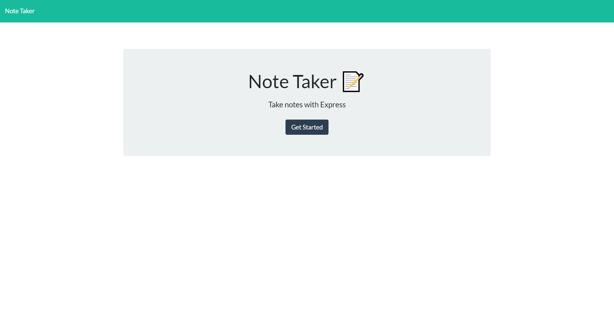
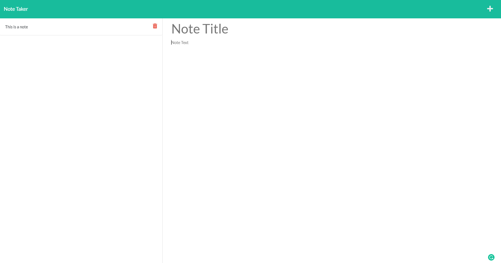

# Note Taker
## Description
 This app allows you to let you take notes, delete singular notes, and view different notes when you on them.
## Table of Contents
- [Installation](#installation)
- [Usage](#usage)
- [Credits](#credits)
- [License](#license)
## Installation

## Usage
Click on get started button and write down your notes. To save notes hit the save icon(floppy disk).
(https://kenfnotetaker.herokuapp.com/)

## License
 (https://opensource.org/licenses/MIT)

## Questions
If you have any questions contact me on
GitHub: (github.com/axumdzn)
Email: (KenFelixCS@gmail.com)
